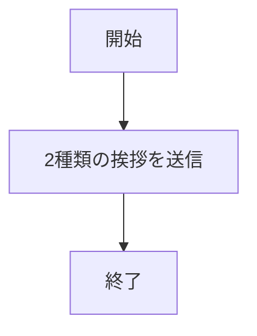
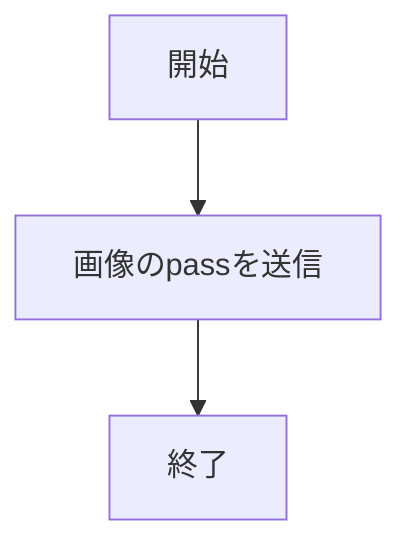
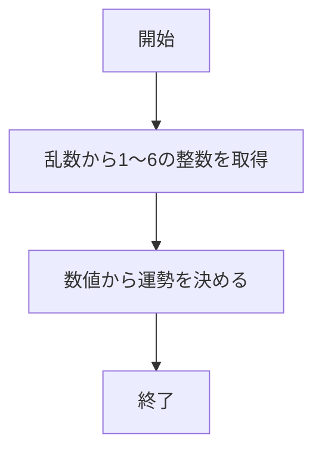
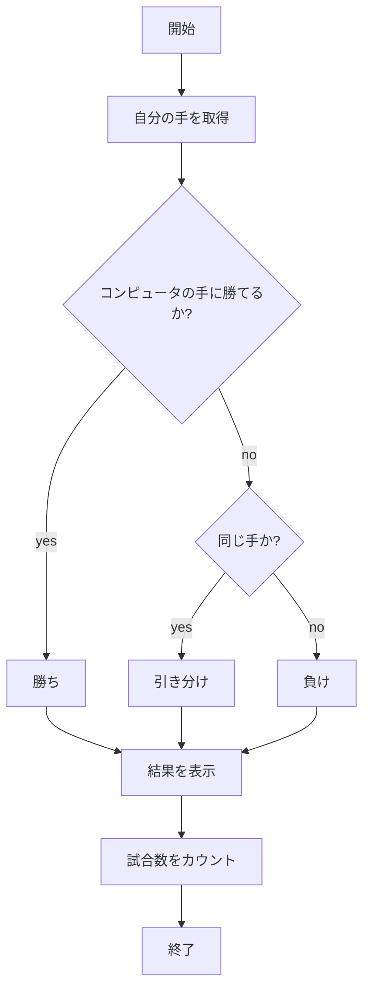
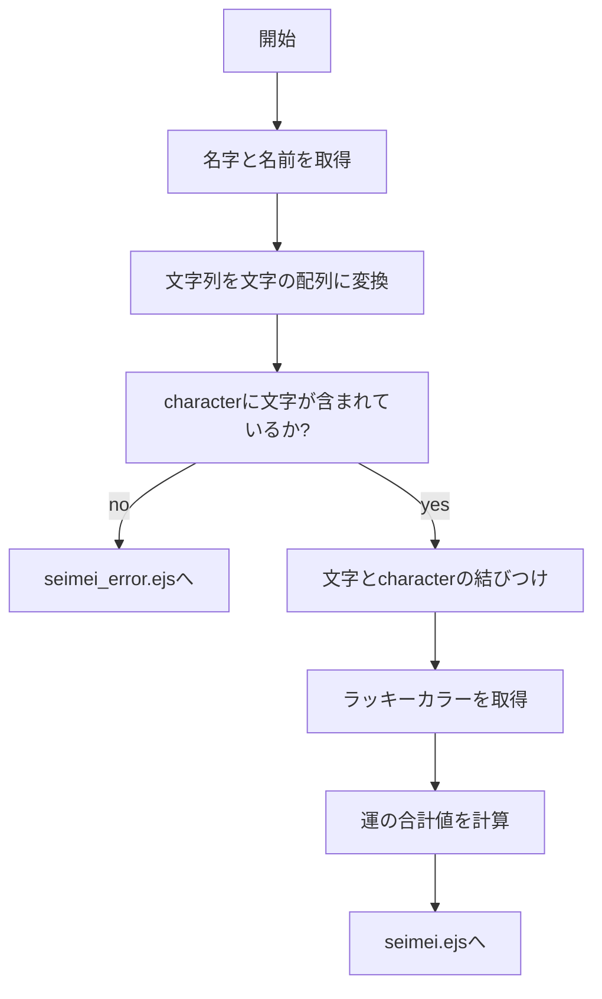
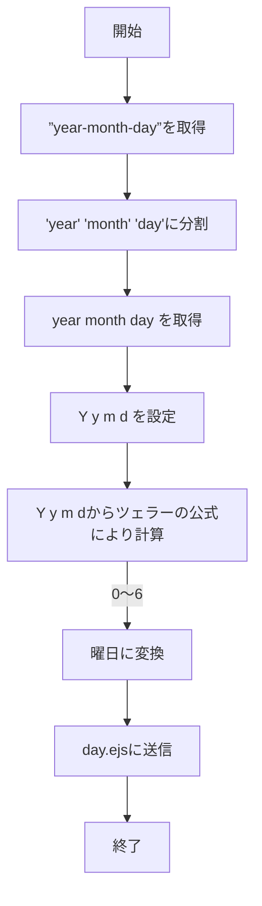

# webpro_06
*2024/11/ME*

## webpro_06について

<!--
コード全部を載せるのは邪道
※必要な部分だけ載せて文量を減らす
-->

このフォルダは```app5.js```を用いて，Webブラウザを通して様々なサービスを提供するためのものである．

```app5.js```には以下に示す機能を持つサービスがある．

サービス名 | 機能
-|-
hello1 | 英語とフランス語で挨拶
hello2 | 英語とフランス語で挨拶
icon | Apple社のロゴを表示
luck | おみくじで運勢を占う
janken | コンピュータとじゃんけん勝負
seimei | 姓名から運勢を占う
day | 指定した日付の曜日を求める

これらのサービスは，```index.html```にてサービスへのアクセスの一覧が載っている．

以下にこれらのサービスのアクセスの手順について説明する．
1. ```app5.js```を起動する
1. Webブラウザで```localhost:8080/public/index.html```にアクセスする
1. 利用したいサービス名をクリックする

***

## 各サービスについて

ここでは，各サービスの利用方法及びプログラムについて説明する．

### hello1
##### 概要
このサービスは，英語の挨拶```Hello World```とフランス語の挨拶```Bon jour```をWebブラウザに表示するものである．

##### 利用方法
このサービスの利用方法は，```index.html```において```hello1```をクリックするだけで利用ができる．

##### ファイル構成
ファイル名 | 機能
-|-
show.ejs | hello1及びhello2のテンプレートファイル

##### 内部処理
ここでは，```app5.js```及び構成ファイル内のプログラムについて説明する．

以下に```app5.js```内での処理の流れをフローチャートとして記載する．


次に，各処理の要点をコードを用いて説明する．

```app5.js```において，各挨拶を格納した変数をオブジェクトにし，show.ejsに渡している．
```
res.render('show', { greet1:message1, greet2:message2});
```

### hello2
##### 概要
このサービスは，英語の挨拶```Hello World```とフランス語の挨拶```Bon jour```をWebブラウザに表示するものである．

このサービスの利用方法は，```index.html```において```hello2```をクリックするだけで利用ができる．

##### ファイル構成
ファイル名 | 機能
-|-
show.ejs | hello1及びhello2のテンプレートファイル

##### 内部処理
ここでは，```app5.js```及び構成ファイル内のプログラムについて説明する．

以下に```app5.js```内での処理の流れをフローチャートとして記載する．


次に各処理の要点をコードを用いて説明する．

```app5.js```において，各挨拶を直接オブジェクトにし，show.ejsに渡している．

```
res.render('show', { greet1:"Hello world", greet2:"Bon jour"});
```


### icon
##### 概要
このサービスは，Apple社のロゴであるリンゴの画像をWebブラウザに表示するものである．

##### 利用方法
このサービスの利用方法は，```index.html```において```icon```をクリックするだけで利用ができる．

##### ファイル構成
ファイル名 | 機能
-|-
icon.ejs | iconのテンプレートファイル

##### 内部処理

ここでは，```app5.js```及び構成ファイル内のプログラムについて説明する．

以下に```app5.js```内での処理の流れをフローチャートとして記載する．

次に各処理の要点をコードを用いて説明する．

まず，```app5.js```内で以下のような画像のパスをicon.ejsに渡す．
```
filename:"./public/Apple_logo_black.svg"
```
次に```icon.ejs```において渡されたパスを元に表示を行っている．
```
" alt="<%= alt %>">
```

### luck
##### 概要
このサービスは，乱数を生成する```rand関数```を用いて運勢を大吉から凶までの6種類で占うものである．

##### 利用方法
このサービスの利用方法は，```index.html```において```luck```をクリックするだけで占うことができる．また，ページをリロードするたびに運勢を再度占ってくれる．

##### ファイル構成
ファイル名 | 機能
-|-
luck.ejs | luckのテンプレートファイル

##### 内部処理
ここでは，```app5.js```及び構成ファイル内のプログラムについて説明する．

以下に```app5.js```内での処理の流れをフローチャートとして記載する．

次に各処理の要点をコードを用いて説明する．

まず，```app5.js```において```rand関数```を用いた以下のコードにより1から6までの乱数を出力させる．
```
const num = Math.floor( Math.random() * 6 + 1 );
```
次に，以下のif文により生成された数字から運勢を表す文字列を渡す．
```
if( num==1 ) luck = '大吉';
else if( num==2 ) luck = '中吉';
else if( num==3 ) luck = '小吉';
else if( num==4 ) luck = '吉';
else if( num==5 ) luck = '末吉';
else if( num==6 ) luck = '凶';
```
その文字列を元に```luck.ejs```において以下のコードにより表示を行う．
```
<p>あなたの今日の運勢は<%= luck %>です．</p>
```
### janken
##### 概要
このサービスは，乱数を生成するrand関数を用いてコンピュータの手を決め，自身が指定した手とじゃんけん勝負を行うものである．

##### 利用方法
このサービスの利用方法は，以下の実行手順により利用ができる
1. ```index.html```内の```janken```をクリックする
1. 入力欄に自分の手(パー，グー，チョキ)を入力する
1. 送信を押す

この手順を実行することにより，コンピュータとじゃんけんを行うことができる．
再度じゃんけんを行う場合．ページにある入力欄に自分の手を入力し送信を押すと行うことができる．
その際，じゃんけんの結果により合計試合数と勝利数が更新される．

##### ファイル構成
ファイル名 | 機能
-|-
janken.html | jankenの開始画面
janken.ejs | jankenのテンプレートファイル

##### 内部処理
ここでは，```app5.js```及び構成ファイル内のプログラムについて説明する．

以下に```app5.js```内での処理の流れをフローチャートとして記載する．

次に各処理の要点をコードを用いて説明する．

まず，```app5.js```において```janken.html```に入力された自分の手をもらう．
```
let hand = req.query.hand;
```
次に，```rand関数```を用いた以下のコードを用いて1から3の乱数を出力させ，if文により，コンピュータの手に変換する．
```
const num = Math.floor( Math.random() * 3 + 1 );
let cpu = '';
if( num==1 ) cpu = 'グー';
else if( num==2 ) cpu = 'チョキ';
else cpu = 'パー';
```
そして，自分の手とコンピュータの手をswitch文を用いて条件分岐させ，勝敗を決める．
ここでは，自分の手がグーの場合のコードを記載する．
```
switch(hand){
    case "グー":
      switch(cpu){
        case "グー":
          result = 0;
          break;
        case "チョキ":
          result = 1;
          break;
        case "パー":
          result = -1;
          break;
      }
```

最後に，自分の手，コンピュータの手などの情報をオブジェクトとしてまとめて```janken.ejs```に渡している．
```
const display = {
    your: hand,
    cpu: cpu,
    judgement: judgement,
    win: win,
    total: total
}
```


### seimei
##### 概要
このサービスは，入力された名字3文字と名前3文字からラッキーカラーと運勢を占うものである．

##### 利用方法
このサービスの利用方法は，以下の実行手順により利用ができる
1. ```index.html```内の```seimei```をクリックする
1. 2つの入力欄にそれぞれ名字3文字，名前3文字を入力する．
1. 送信を押す

この手順を実行することにより，入力された姓名からラッキーカラーと運勢を占ってくれる．再度占う場合は，ページの下にある2つの入力欄に名字，名前それぞれ3文字を入力し，送信を押すことで行うことができる．

ただし，ひらがな以外の文字入力した場合，判断ができず占うことができない．また，3文字以上入力した場合，最初の3文字を占いの対象として判断する．

##### ファイル構成
ファイル名 | 機能
-|-
seimei.html | seimeiの開始画面
seimei.ejs | seimeiのテンプレートファイル
seimei_error.ejs | 占いができない場合のテンプレートファイル

##### 内部処理
ここでは，```app5.js```及び構成ファイル内のプログラムについて説明する．

以下に```app5.js```内での処理の流れをフローチャートとして記載する．

次に各処理の要点をコードを用いて説明する．

まず，```seimei.html```から入力された名字と名前を文字列として受け取り，文字列から文字の配列に変換する．
```
let first_name = req.query.first;
let family_name = req.query.family;
let first_str = first_name.split("");
let family_str = family_name.split("");
```
次に，作成した関数```str_length_floor関数```を用いて配列の長さを調べ，それぞれの長さを３にする．
```
function str_length_floor(target_str, max_length){
  target_str.splice(target_str.length - max_length + 1, target_str.length - max_length);
  return target_str;
}
```

そして，作成した関数```get_char_info関数```を用いて，文字ごとにラッキーカラーと運勢を持ったオブジェクト配列characterから対象の文字を探し，結びつけを行う．
```
function get_char_info(target_str){
  let target_info = [];
  target_str.forEach(value => {
      target_info.push(character.find(id => id.shape === value));
  });
  return target_info;
}
```
```get_char_info関数```の結びつけの結果から，姓名のラッキーカラーや運勢を調べ，
もっとも多い色をラッキーカラー，運勢を各文字の運の合計値を結果としてseimei.ejsに渡している．

オブジェクト配列characterは以下のような構造になっている．
例として一部分の5母音を記載する．
```
const character = 
[
  {shape: "あ", luck: 3, color: "red"},
  {shape: "い", luck: 2, color: "blue"},
  {shape: "う", luck: 2, color: "green"},
  {shape: "え", luck: 2, color: "yellow"},
  {shape: "お", luck: 3, color: "black"},
```
また，作成した関数```check_char関数```を用いて，対象内の文字かを調べる．
```
function check_char(target_str){
  let error = false;
  target_str.forEach(value => {
      character.find(id => id.shape === value)? null : error = true;
  });
  return error;
}
```
```check_char関数```の結果を踏まえ，行き先を```seimei_error.ejs```か```seimei.ejs```かを判別している．


### day
##### 概要
このサービスは，入力された年月日からツェラーの公式を用いて曜日を求め，曜日をWebブラウザに表示するものである．

##### 利用方法
このサービスの利用方法は，以下の実行手順により利用ができる
1. ```index.html```内の```day```をクリックする
1. 入力欄にカレンダーを用いて任意の年月日を入力する
1. 送信を押す

この手順を実行することにより，指定された年月日から曜日を求め，表示を行う．

##### ファイル構成
ファイル名 | 機能
-|-
day.html | dayの開始画面
day.ejs | dayのテンプレートファイル

##### 内部処理
ここでは，```app5.js```及び構成ファイル内のプログラムについて説明する．

以下に```app5.js```内での処理の流れをフローチャートとして記載する．

次に各処理の要点をコードを用いて説明する．

まず，```day.html```から年月日の文字列を受け取り，年と月と日を数字に変換したうえでそれぞれ格納している．
```
let date = req.query.date;
let date_info = date.split("-");

let year = Number(date_info[0]);
let month = Number(date_info[1]);
let days = Number(date_info[2]);
```

次に，曜日を求めるための下準備を行い，```ツェラーの公式```により曜日に該当する数値を求める．
```
let y = month<3? year-1:year;
let Y = y%100;
let m = month<3? month+12:month;
let d = days;
  
let _day1 = Y+Math.floor(Y/4)-2*Math.floor(y/100)+Math.floor(y/400);
let _day2 = Math.floor((26*(m+1))/10)+d;
let day_number = (_day1+_day2)%7;
```
最後に，数値を曜日の文字列に変換し，```day.ejs```に渡している．
